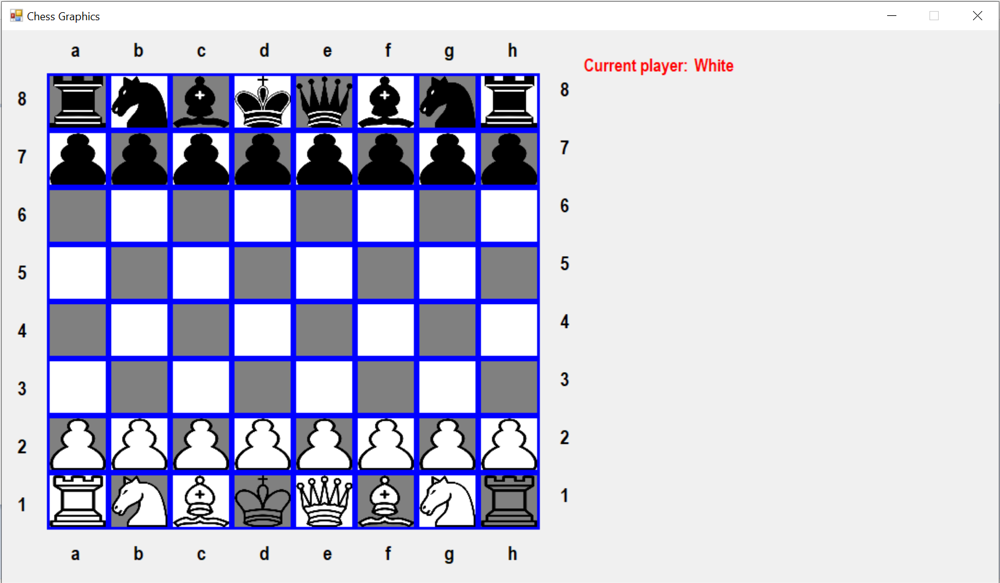

# Chess Game with Graphics and Functionality

A complete chess game built in C++ with an interactive graphical interface and functional gameplay mechanics. This project includes the source code and a prebuilt executable.

## Methods to Play the Game

### 1. **Play the Game with the Executable**

- Download the repository as a ZIP file or clone it using Git.
- Navigate to the folder where the repository is located.
- Locate the `chessgame.exe` file in the root directory (or `bin/` if used).
- Double-click on the executable to start the game.

### 2. **Build the Game from Source Code**

- Open the `ChessGame.sln` solution file in **Visual Studio**.
- Build the solution by clicking **Build** -> **Build Solution**.
- Once the build is complete, locate the `.exe` file in the build output folder (e.g., `Debug/` or `Release/`).
- Double-click the executable to run the game.

## How to Contribute

Feel free to fork the repository, open issues, and submit pull requests to improve the game.

---

## Screenshots

